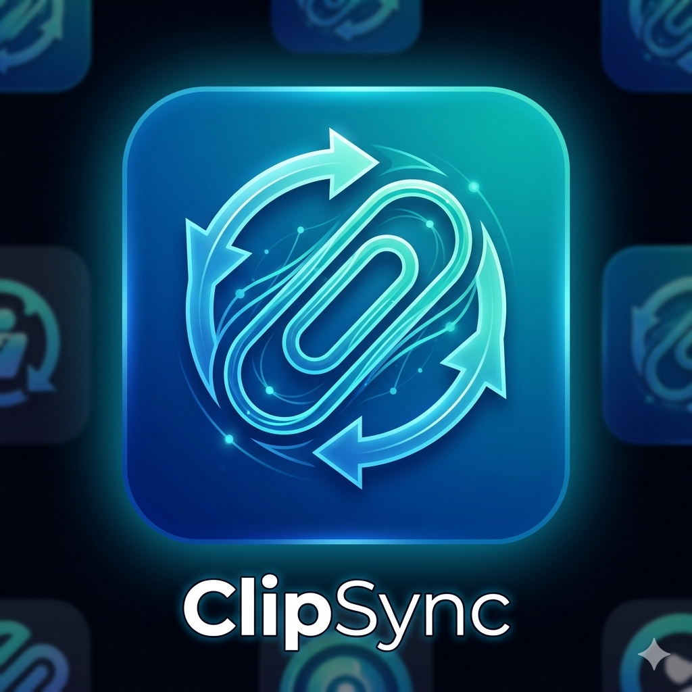

<p align="center">
  
</p>

# ClipSync v3.0
**A seamless, cross-platform clipboard and file synchronizer for Windows, Linux, and Android.**

ClipSync creates an encrypted, decentralized P2P mesh network over your local Wi-Fi. The moment you copy text, images, or files on one device, it instantly appears on all your other connected devices. No cloud servers, no accounts, no internet routing—just instant, secure local synchronization.

---

## 🌟 Features
* **Cross-Platform & Unified Desktop**: A single, unified `clip_sync_desktop` package for both Windows 11 and Linux (Kali, Ubuntu, etc.) with a beautiful Flask-based Web Dashboard. Native Android app support.
* **True P2P Architecture**: Decentralized mesh network using mDNS (Zeroconf) and Secure WebSockets (`wss://`).
* **Binary File & Image Transfer**: Send files (PDF, TXT, EXCEL) and images (PNG, JPG) securely between devices using a chunked protocol (Max 100MB). Files are automatically saved to `Downloads/ClipSync` on Windows, `Documents/ClipSync` on Linux, and `internal_storage/ClipSync` on Android.
* **Military-Grade Security (OWASP Top 10 2025 Hardened)**: 
  - TLS 1.3 Transport Encryption + 100% End-to-End Encrypted (E2EE) payloads using AES-256-GCM.
  - Strict 30-second timestamp windows and dynamic Nonce caching to thwart Replay Attacks.
  - File hashing (SHA-256) to ensure integrity of transferred files.
  - Rate Limiting and HMAC Challenges for robust Authentication.
* **Content Filtering**: Automatically detects and blocks syncing of highly sensitive data like Credit Cards and Private Keys, and explicitly blocks executable file transfers (`.exe`, `.sh`).

---

## 💻 Installation & Setup

### 🪟 Windows Setup (Flask GUI)
**Prerequisites:** Python 3.10+
1. Navigate to the unified desktop directory: `cd clip_sync_desktop`
2. Create and activate a virtual environment (optional but recommended):
   ```cmd
   python -m venv venv
   call venv\Scripts\activate
   ```
3. Install dependencies:
   ```cmd
   pip install -r requirements.txt
   ```
4. Setup Security:
   - Copy `.env.example` to `.env`.
   - Open `.env` and enter a strong 64-character hex string as your `SECRET_KEY`. **This key remains entirely local to your machine and is never pushed to GitHub.**
5. Run the app:
   ```cmd
   python app.py
   ```
6. Open your web browser and navigate to `http://127.0.0.1:5000` to view the beautiful ClipSync Dashboard!

### 🐧 Linux Setup (Flask GUI)
If you are pulling these new changes on a Linux machine, follow these steps:
```bash
# Pull the latest changes from GitHub
git pull origin main

# Install system dependencies for clipboard (if not already installed)
sudo apt-get update
sudo apt-get install xclip xsel libmagic1
```
1. Navigate to the unified desktop directory: `cd clip_sync_desktop`
2. Install Python dependencies:
   ```bash
   pip3 install -r requirements.txt
   ```
3. Setup Security:
   - Copy `.env.example` to `.env` and set your `SECRET_KEY` (must match your other devices).
4. Run the app:
   ```bash
   python3 app.py
   ```
5. Open your browser to `http://127.0.0.1:5000`.

### 📱 Android Setup (Flutter)
The Android app has been updated. The pre-built `.env` secrets have been **completely removed from the source code** to ensure maximum security. All keys are now dynamically configured by the user via the app interface and securely stored in encrypted SharedPreferences.

1. Install the latest `app-release.apk` on your Android device.
2. Open the ClipSync app. It will present a **Setup Screen**.
3. Paste the exact same 64-character `SECRET_KEY` that you placed in your Desktop `.env` file.
4. Tap **Save & Connect**.
5. **Where are files saved?** Android files are saved to a custom `ClipSync` folder inside your internal storage.

---

## 🛠️ Troubleshooting & Debugging

**1. Devices cannot find each other (No mDNS Discovery)**
* **Cause:** Your router is blocking mDNS multicast packets, or "AP Isolation" (Guest Mode) is turned on in your Wi-Fi settings.
* **Fix:** Log into your router and disable "AP Isolation", "Client Isolation", or "Guest Network". Ensure multicasting is enabled.

**2. "SECRET_KEY not found" or "Decryption Failed" Logs**
* **Cause:** Your secret keys do not perfectly match across your devices.
* **Fix:** Check your desktop `clip_sync_desktop/.env` file and verify it perfectly matches the key entered in the Android Settings page.

**3. Linux Client Cannot Copy Images**
* **Cause:** `xclip` is missing.
* **Fix:** Run `sudo apt-get install xclip`. If using Wayland, ensure you have XWayland compatibility or install `wl-clipboard`.

**4. "File Too Large" Error**
* **Cause:** ClipSync restricts file transfers to 100MB to prevent memory exhaustion and DoS attacks.
* **Fix:** Compress files or use a dedicated bulk transfer tool for larger files.

**5. Executable Files Are Blocked**
* **Cause:** For security against RCE (Remote Code Execution), ClipSync actively blocks syncing of `.exe`, `.bat`, `.sh`, `.vbs`, and other dangerous executables.
* **Fix:** This is an intentional security feature. Zip the file first if you absolutely must transfer it.

## 🤝 Contributing
Feel free to open issues or submit Pull Requests for enhancements!
