# 🛡️ ClipSync — VAPT & Vulnerability Assessment Report

**Classification:** CONFIDENTIAL — Red Team Assessment  
**Date:** July 9, 2026  
**Target System:** ClipSync v1.0 (Cross-Platform Clipboard Synchronizer)  
**Repository:** [StrykarBoston/Clip-Sync](https://github.com/StrykarBoston/Clip-Sync)  
**Assessor:** Kali Linux MCP Offensive Security Toolkit  
**Methodology:** OWASP, PTES, NIST SP 800-115  

---

## 📋 Executive Summary

A comprehensive Vulnerability Assessment and Penetration Testing (VAPT) was conducted against the ClipSync system — a decentralized, cross-platform clipboard synchronization tool operating over LAN/Wi-Fi using WebSockets and AES-256-GCM encryption.

> [!CAUTION]
> **Overall Risk Rating: HIGH**  
> While ClipSync implements strong cryptographic primitives (AES-256-GCM, TLS 1.3), multiple critical vulnerabilities were discovered in the areas of **TLS configuration**, **certificate validation**, **denial of service**, **information leakage via mDNS**, and **connection authentication**. An attacker on the same LAN can intercept encrypted clipboard data, perform MITM attacks, and deny service to legitimate users.

### Key Metrics

| Metric | Value |
|--------|-------|
| Critical Vulnerabilities | 5 |
| High Vulnerabilities | 6 |
| Medium Vulnerabilities | 4 |
| Low Vulnerabilities | 3 |
| Informational | 2 |
| **Total Findings** | **20** |

---

## 🌐 Scope & Target Environment

### Live Hosts Discovered on LAN (192.168.1.0/24)

| IP Address | MAC Address | Vendor | Role |
|------------|-------------|--------|------|
| 192.168.1.1 | 70:B6:4F:37:44:35 | Guangzhou V-Solution | Gateway/Router |
| 192.168.1.2 | EC:75:0C:E5:A9:34 | TP-Link Systems | Network Device |
| 192.168.1.3 | 94:EC:13:0C:51:0D | Hangzhou Ezviz | IoT Camera |
| 192.168.1.5 | 08:BF:B8:D0:08:74 | ASUSTek Computer | PC/Workstation |
| **192.168.1.6** | **82:A7:B6:E5:E6:B3** | **Unknown** | **ClipSync Android Node** |
| **192.168.1.12** | **Local (Kali)** | **-** | **ClipSync Linux Node** |

### ClipSync Service Fingerprint

| Property | Value |
|----------|-------|
| Service Port | TCP/52300 (WSS) |
| mDNS Service Type | `_clipsync._tcp.local` |
| TLS Protocol | TLSv1.0, TLSv1.1, TLSv1.2, **TLSv1.3** |
| TLS Cipher (negotiated) | TLS_AES_256_GCM_SHA384 |
| Server Banner | `Python/3.13 websockets/16.0` |
| Certificate | Self-signed, RSA 2048-bit, SHA-256, 1-year validity |
| Certificate Subject | `O=ClipSync Local Mesh, CN=localhost` |
| Certificate SAN | `DNS:localhost, IP:127.0.0.1, IP:192.168.1.12` |

---

## 🔴 Vulnerability Findings

---

### VULN-001: Deprecated TLS Versions Enabled (TLSv1.0, TLSv1.1)

| Field | Detail |
|-------|--------|
| **Severity** | 🔴 CRITICAL |
| **CVE** | [CVE-2011-3389](https://nvd.nist.gov/vuln/detail/CVE-2011-3389) (BEAST), [CVE-2014-3566](https://nvd.nist.gov/vuln/detail/CVE-2014-3566) (POODLE) |
| **CWE** | [CWE-326](https://cwe.mitre.org/data/definitions/326.html) — Inadequate Encryption Strength |
| **CVSS v3.1** | 7.5 (High) |
| **Affected** | All Python desktop nodes (Windows & Linux) |

**Evidence:**
```
TLSv1.0:
  ciphers:
    TLS_ECDH_anon_WITH_AES_256_CBC_SHA (ecdh_x25519) - F
    TLS_ECDH_anon_WITH_AES_128_CBC_SHA (ecdh_x25519) - F
  warnings:
    Anonymous key exchange, score capped at F

TLSv1.1:
  ciphers:
    TLS_ECDH_anon_WITH_AES_256_CBC_SHA (ecdh_x25519) - F
    TLS_ECDH_anon_WITH_AES_128_CBC_SHA (ecdh_x25519) - F
  warnings:
    Anonymous key exchange, score capped at F
```

**Impact:** An attacker can force a protocol downgrade from TLS 1.3 to TLS 1.0/1.1 and exploit known vulnerabilities (BEAST, POODLE) to decrypt clipboard traffic in transit.

**Recommendation:** Explicitly disable TLS 1.0 and TLS 1.1 in the Python SSL context:
```python
ssl_ctx.minimum_version = ssl.TLSVersion.TLSv1_2  # or TLSv1_3
```

---

### VULN-002: Anonymous TLS Cipher Suites Accepted (Score: F)

| Field | Detail |
|-------|--------|
| **Severity** | 🔴 CRITICAL |
| **CVE** | [CVE-2007-1858](https://nvd.nist.gov/vuln/detail/CVE-2007-1858) |
| **CWE** | [CWE-327](https://cwe.mitre.org/data/definitions/327.html) — Use of Broken Crypto Algorithm |
| **CVSS v3.1** | 9.1 (Critical) |
| **Affected** | All Python desktop nodes |

**Evidence:**
```
TLS_ECDH_anon_WITH_AES_256_CBC_SHA — rated F
TLS_ECDH_anon_WITH_AES_128_CBC_SHA — rated F
(Present in TLSv1.0, TLSv1.1, AND TLSv1.2)
```

**Impact:** Anonymous cipher suites provide **zero authentication**. An attacker can perform a transparent MITM attack without needing any certificate at all — the TLS handshake completes with anonymous key exchange, and the attacker can read all clipboard data in cleartext.

**Recommendation:** Restrict cipher suites to authenticated ones only:
```python
ssl_ctx.set_ciphers('ECDHE+AESGCM:ECDHE+CHACHA20:DHE+AESGCM:!aNULL:!eNULL:!EXPORT:!DES:!RC4:!MD5')
```

---

### VULN-003: Android App Disables TLS Certificate Validation

| Field | Detail |
|-------|--------|
| **Severity** | 🔴 CRITICAL |
| **CVE** | [CVE-2014-0050](https://nvd.nist.gov/vuln/detail/CVE-2014-0050) (class of improper cert validation) |
| **CWE** | [CWE-295](https://cwe.mitre.org/data/definitions/295.html) — Improper Certificate Validation |
| **CVSS v3.1** | 8.1 (High) |
| **Affected** | Android (Flutter) app |

**Evidence from** `lib/main.dart`:
```dart
class MyHttpOverrides extends HttpOverrides {
  @override
  HttpClient createHttpClient(SecurityContext? context) {
    return super.createHttpClient(context)
      ..badCertificateCallback = (X509Certificate cert, String host, int port) => true;
  }
}

void main() async {
  HttpOverrides.global = MyHttpOverrides();
  // ...
}
```

**Impact:** The Android app accepts **ANY certificate**, including attacker-generated ones. Combined with ARP spoofing, an attacker can transparently intercept all clipboard data between the Android device and the mesh network.

**Recommendation:** Implement certificate pinning using the known self-signed certificate hash, or use a trust-on-first-use (TOFU) model.

---

### VULN-004: No WebSocket Connection Rate Limiting (DoS)

| Field | Detail |
|-------|--------|
| **Severity** | 🔴 CRITICAL |
| **CWE** | [CWE-770](https://cwe.mitre.org/data/definitions/770.html) — Allocation of Resources Without Limits |
| **CVSS v3.1** | 7.5 (High) |
| **Affected** | All nodes |

**Evidence:**
```
[*] Attempting 50 simultaneous WebSocket connections...
[+] Successfully opened 50/50 connections
[CRITICAL] No connection limiting! Server vulnerable to connection exhaustion DoS

[*] Testing WebSocket ping flood...
[+] Sent 100/100 ping frames
[WARNING] No ping rate limiting detected
```

**Impact:** An attacker can exhaust all server resources (file descriptors, memory, threads) by opening hundreds of WebSocket connections simultaneously. This **completely denies service** to legitimate ClipSync peers.

**Recommendation:**
- Implement per-IP connection limits (max 3-5 per IP)
- Add WebSocket message rate limiting
- Implement connection timeout for unauthenticated sessions

---

### VULN-005: No Payload Size Validation

| Field | Detail |
|-------|--------|
| **Severity** | 🔴 CRITICAL |
| **CWE** | [CWE-400](https://cwe.mitre.org/data/definitions/400.html) — Uncontrolled Resource Consumption |
| **CVSS v3.1** | 7.5 (High) |
| **Affected** | All nodes |

**Evidence:**
```
[Test 2] Sending oversized payload (100KB)...
  Server accepted 100KB payload!
  [WARNING] No payload size limit detected
```

**Impact:** An attacker can send arbitrarily large payloads to consume server memory. Repeated large payloads can lead to OOM (Out of Memory) conditions and crash the ClipSync service.

**Recommendation:** Enforce `max_size` on WebSocket connections:
```python
async with serve(handler, host, port, max_size=8192):
```

---

### VULN-006: Server Version Information Disclosure

| Field | Detail |
|-------|--------|
| **Severity** | 🟡 HIGH |
| **CWE** | [CWE-200](https://cwe.mitre.org/data/definitions/200.html) — Exposure of Sensitive Information |
| **CVSS v3.1** | 5.3 (Medium) |
| **Affected** | All Python desktop nodes |

**Evidence:**
```http
HTTP/1.1 101 Switching Protocols
Server: Python/3.13 websockets/16.0
```

**Impact:** Reveals exact Python runtime version and websockets library version, enabling targeted CVE exploitation.

**Recommendation:** Suppress the `Server` header:
```python
serve(handler, host, port, server_header=None)
```

---

### VULN-007: mDNS Information Leakage — Device Identifiers & Fingerprints

| Field | Detail |
|-------|--------|
| **Severity** | 🟡 HIGH |
| **CWE** | [CWE-200](https://cwe.mitre.org/data/definitions/200.html) — Exposure of Sensitive Information |
| **CVSS v3.1** | 6.5 (Medium) |
| **Affected** | All nodes |

**Evidence:**
```
[+] mDNS response from 192.168.1.12:5353
  Linux node name: "ClipSync Linux-35a9" (device ID suffix leaked)

[+] mDNS response from 192.168.1.6:5353
  Android node name: "ClipSync Android-31b9" (device ID suffix leaked)
  Android hostname: "Android_NIKMYTBI" (device hostname leaked!)
```

**Impact:**
1. **Platform identification** — attacker knows which nodes are Windows/Linux/Android
2. **Device ID suffix leaked** — partial UUID exposed in mDNS instance name
3. **Hostname leaked** — Android device hostname ("Android_NIKMYTBI") exposed
4. **Network fingerprint** (SHA-256(SECRET_KEY)[:16]) broadcast in TXT records enables offline brute-force targeting of the PSK

**Recommendation:**
- Use generic service names without platform/device identifiers
- Do not broadcast the key fingerprint (use challenge-response instead)

---

### VULN-008: SECRET_KEY Fingerprint Broadcast via mDNS

| Field | Detail |
|-------|--------|
| **Severity** | 🟡 HIGH |
| **CWE** | [CWE-312](https://cwe.mitre.org/data/definitions/312.html) — Cleartext Storage of Sensitive Information |
| **CVSS v3.1** | 6.8 (Medium) |
| **Affected** | All nodes |

**Evidence from source code:**
```python
NETWORK_FINGERPRINT = hashlib.sha256(SHARED_SECRET_HEX.encode('utf-8')).hexdigest()[:16]
```

This fingerprint is broadcast in mDNS TXT records to ALL devices on the LAN.

**Impact:** Any device on the Wi-Fi network can capture this fingerprint and use it as an oracle for offline brute-force attacks against the SECRET_KEY. While SHA-256 is one-way, the 16-character prefix is sufficient to validate key guesses.

**Recommendation:** Replace mDNS fingerprint with a time-based challenge that doesn't leak static key material.

---

### VULN-009: No Associated Data (AAD) in AES-GCM Encryption

| Field | Detail |
|-------|--------|
| **Severity** | 🟡 HIGH |
| **CWE** | [CWE-347](https://cwe.mitre.org/data/definitions/347.html) — Improper Verification of Cryptographic Signature |
| **CVSS v3.1** | 5.9 (Medium) |
| **Affected** | All nodes |

**Evidence:**
```python
ciphertext = self.aesgcm.encrypt(nonce, plaintext, None)  # None = no AAD
```

**Impact:** Without AAD, there is no cryptographic binding between the ciphertext and its context (sender identity, timestamp, message type). This enables cross-context replay attacks where an encrypted "hello" message could theoretically be reused as a "clipboard" message if the internal structure matches.

**Recommendation:**
```python
aad = f"{DEVICE_ID}:{msg_type}:{timestamp}".encode()
ciphertext = self.aesgcm.encrypt(nonce, plaintext, aad)
```

---

### VULN-010: No Key Rotation Mechanism — Static PSK

| Field | Detail |
|-------|--------|
| **Severity** | 🟡 HIGH |
| **CWE** | [CWE-321](https://cwe.mitre.org/data/definitions/321.html) — Use of Hard-Coded Cryptographic Key |
| **CVSS v3.1** | 6.5 (Medium) |
| **Affected** | All nodes |

**Impact:** The same SECRET_KEY is used by ALL devices forever. If any single device is compromised (malware, physical access, .env file theft), the entire mesh network is permanently compromised. There is no mechanism to rotate the key without manually updating every device.

**Recommendation:** Implement periodic key rotation or ephemeral session keys derived from the PSK using HKDF.

---

### VULN-011: No Key Derivation Function (KDF)

| Field | Detail |
|-------|--------|
| **Severity** | 🟡 HIGH |
| **CWE** | [CWE-916](https://cwe.mitre.org/data/definitions/916.html) — Use of Password Hash With Insufficient Effort |
| **CVSS v3.1** | 5.9 (Medium) |
| **Affected** | All nodes |

**Evidence:**
```python
self.aesgcm = AESGCM(bytes.fromhex(SHARED_SECRET_HEX))
```

**Impact:** The raw hex key is used directly as the AES encryption key without passing through any key derivation function (HKDF, PBKDF2, Argon2). If a user chooses a weak or predictable hex string, the encryption is directly vulnerable.

**Recommendation:**
```python
from cryptography.hazmat.primitives.kdf.hkdf import HKDF
derived_key = HKDF(algorithm=hashes.SHA256(), length=32, salt=None, info=b'clipsync-e2ee').derive(bytes.fromhex(SHARED_SECRET_HEX))
```

---

### VULN-012: TLS Certificate SAN Reveals Internal IP Addresses

| Field | Detail |
|-------|--------|
| **Severity** | 🟠 MEDIUM |
| **CWE** | [CWE-200](https://cwe.mitre.org/data/definitions/200.html) |
| **CVSS v3.1** | 4.3 (Medium) |
| **Affected** | All nodes |

**Evidence:**
```
Subject Alternative Name: DNS:localhost, IP:127.0.0.1, IP:192.168.1.12
```

**Impact:** Internal IP addresses are embedded in the self-signed certificate and exposed to any connecting client. This aids network reconnaissance.

---

### VULN-013: Self-Signed Certificate — No Trust Chain

| Field | Detail |
|-------|--------|
| **Severity** | 🟠 MEDIUM |
| **CWE** | [CWE-295](https://cwe.mitre.org/data/definitions/295.html) |
| **CVSS v3.1** | 5.9 (Medium) |
| **Affected** | All nodes |

**Evidence:**
```
Verification error: self-signed certificate (error 18)
Subject = Issuer = O=ClipSync Local Mesh, CN=localhost
```

**Impact:** Without a CA or certificate pinning, any device can generate its own "ClipSync Local Mesh" certificate and be accepted by peers. Combined with VULN-003 (Android disabling cert validation entirely), this makes MITM trivial.

**Recommendation:** Implement Trust-On-First-Use (TOFU) with certificate fingerprint pinning.

---

### VULN-014: RSA 2048-bit Key Size

| Field | Detail |
|-------|--------|
| **Severity** | 🟠 MEDIUM |
| **CWE** | [CWE-326](https://cwe.mitre.org/data/definitions/326.html) |
| **CVSS v3.1** | 4.0 (Medium) |
| **Affected** | All nodes |

**Evidence:**
```python
private_key = rsa.generate_private_key(public_exponent=65537, key_size=2048)
```

**Impact:** RSA 2048 is nearing end-of-life per NIST guidance (deprecated after 2030). For a security-focused application claiming "Military-Grade Security," this is below best practices.

**Recommendation:** Use RSA 4096 or ECDSA P-384 for certificate keys.

---

### VULN-015: Rejection Messages Sent in Plaintext

| Field | Detail |
|-------|--------|
| **Severity** | 🟠 MEDIUM |
| **CWE** | [CWE-209](https://cwe.mitre.org/data/definitions/209.html) — Generation of Error Message Containing Sensitive Information |
| **CVSS v3.1** | 4.3 (Medium) |
| **Affected** | All nodes |

**Evidence:**
```json
{"status": "rejected", "reason": "invalid_payload"}
```

**Impact:** Rejection messages are sent as **plaintext JSON** (not encrypted), revealing that the server is running ClipSync and providing the specific rejection reason. This enables an attacker to enumerate valid vs. invalid message formats.

**Recommendation:** Send rejection messages encrypted, or simply close the connection silently.

---

### VULN-016: In-Memory Nonce Cache Lost on Restart

| Field | Detail |
|-------|--------|
| **Severity** | 🟢 LOW |
| **CWE** | [CWE-384](https://cwe.mitre.org/data/definitions/384.html) |
| **CVSS v3.1** | 3.7 (Low) |
| **Affected** | All nodes |

**Impact:** When a node restarts, its nonce cache is cleared. Previously-seen nonces will be accepted again, enabling replay attacks during the 30-second timestamp window after restart.

---

### VULN-017: SECRET_KEY Stored in Plaintext .env File

| Field | Detail |
|-------|--------|
| **Severity** | 🟢 LOW |
| **CWE** | [CWE-312](https://cwe.mitre.org/data/definitions/312.html) |
| **CVSS v3.1** | 3.3 (Low) |
| **Affected** | Windows & Linux desktop nodes |

**Impact:** The SECRET_KEY is stored unencrypted in a `.env` file on disk. Any local user or malware with file read access can extract the key and join or impersonate the mesh network.

---

### VULN-018: No Peer Authentication Beyond PSK

| Field | Detail |
|-------|--------|
| **Severity** | 🟢 LOW |
| **CWE** | [CWE-306](https://cwe.mitre.org/data/definitions/306.html) — Missing Authentication |
| **CVSS v3.1** | 3.7 (Low) |
| **Affected** | All nodes |

**Impact:** Any device with the SECRET_KEY can join the mesh with no further authentication. There is no device registration, whitelisting, or approval workflow.

---

### VULN-019: Sensitive Data Filter Easily Bypassed

| Field | Detail |
|-------|--------|
| **Severity** | ℹ️ INFORMATIONAL |
| **CWE** | [CWE-20](https://cwe.mitre.org/data/definitions/20.html) — Improper Input Validation |

**Evidence:**
```python
def is_sensitive(text):
    if re.search(r'\b(?:\d[ -]*?){13,19}\b', text):
        return True
    if '-----BEGIN' in text and 'PRIVATE KEY-----' in text:
        return True
    return False
```

**Impact:** The filter only checks for credit card patterns and PEM private key headers. It does not detect: SSNs, API keys, passwords, AWS credentials, JWTs, or other sensitive data formats. The `SYNC_SENSITIVE_DATA=true` flag disables even this basic filtering.

---

### VULN-020: New Device ID Generated Each Restart

| Field | Detail |
|-------|--------|
| **Severity** | ℹ️ INFORMATIONAL |
| **CWE** | [CWE-330](https://cwe.mitre.org/data/definitions/330.html) |

**Evidence:**
```python
DEVICE_ID = str(uuid.uuid4())  # Random new ID every restart
```

**Impact:** Peers cannot reliably identify a device across restarts, making it impossible to maintain a peer whitelist or detect impersonation.

---

## 🗺️ Attack Surface Map

```mermaid
graph TD
    subgraph "Attack Surface"
        A["🌐 mDNS Multicast<br/>UDP 5353<br/>(Unauthenticated)"] -->|"Service Discovery<br/>Fingerprint Leak"| B["📡 WebSocket Server<br/>TCP 52300<br/>(Self-signed TLS)"]
        B -->|"TLS Handshake<br/>(TLS 1.0-1.3)"| C["🔓 WebSocket Connection<br/>(No Rate Limit)"]
        C -->|"Auth Handshake<br/>(Encrypted Hello)"| D["📋 Clipboard Data<br/>(E2EE AES-256-GCM)"]
    end

    subgraph "Attack Vectors"
        E["👤 LAN Attacker"] -->|"1. mDNS Sniffing"| A
        E -->|"2. ARP Spoofing + MITM"| B
        E -->|"3. Connection Flooding"| C
        E -->|"4. Replay Attack"| D
        E -->|"5. Protocol Downgrade"| B
    end

    style A fill:#ff6b6b,stroke:#fff,color:#fff
    style B fill:#ffa502,stroke:#fff,color:#fff
    style C fill:#ff6b6b,stroke:#fff,color:#fff
    style D fill:#2ed573,stroke:#fff,color:#fff
    style E fill:#333,stroke:#fff,color:#fff
```



---

## 🔪 Attack Scenarios Demonstrated

### Scenario 1: Clipboard Data Interception (Proven)

An attacker on the same LAN successfully:
1. ✅ Discovered ClipSync nodes via mDNS (`192.168.1.12` Linux, `192.168.1.6` Android)
2. ✅ Connected to the WebSocket server without certificate validation
3. ✅ Completed the WebSocket upgrade handshake
4. ✅ **Captured encrypted clipboard envelopes containing IV + ciphertext**

```
[CAPTURED] Frame opcode=1, payload_len=298
[CRITICAL] Captured E2EE encrypted envelope:
  IV (nonce): HwwB0UlOnmOzjgtw
  Ciphertext: 3NvQzXaS74kjHprTDH1egAnOCXxDMMyuZC6offB5EpOW+C3dpyvP...
  Full ciphertext length: 260 chars
```

> [!WARNING]
> While the E2EE layer prevented plaintext reading, the **transport layer** was completely bypassed. If combined with ARP spoofing + MITM (tools available on Kali: arpspoof, ettercap, bettercap, mitmproxy), an attacker could proxy the E2EE handshake and decrypt clipboard content by relaying with their own session.

### Scenario 2: Denial of Service (Proven)

```
[*] Attempting 50 simultaneous WebSocket connections...
[+] Successfully opened 50/50 connections
[CRITICAL] No connection limiting!

[*] Testing WebSocket ping flood...
[+] Sent 100/100 ping frames
[WARNING] No ping rate limiting detected
```

### Scenario 3: mDNS Reconnaissance (Proven)

```
Linux node: "ClipSync Linux-35a9" at 192.168.1.12
Android node: "ClipSync Android-31b9" at 192.168.1.6
Android hostname: "Android_NIKMYTBI"
```

---

## 📊 Risk Matrix

| # | Vulnerability | Severity | Exploitability | Impact | Status |
|---|--------------|----------|---------------|--------|--------|
| 001 | Deprecated TLS (1.0/1.1) | 🔴 CRITICAL | Easy | High | Confirmed |
| 002 | Anonymous Cipher Suites | 🔴 CRITICAL | Easy | Critical | Confirmed |
| 003 | Android Cert Validation Bypass | 🔴 CRITICAL | Medium | High | Code Review |
| 004 | No Connection Rate Limiting | 🔴 CRITICAL | Easy | High | Confirmed |
| 005 | No Payload Size Limit | 🔴 CRITICAL | Easy | High | Confirmed |
| 006 | Server Version Disclosure | 🟡 HIGH | Easy | Medium | Confirmed |
| 007 | mDNS Info Leakage | 🟡 HIGH | Easy | Medium | Confirmed |
| 008 | SECRET_KEY Fingerprint Broadcast | 🟡 HIGH | Easy | Medium | Confirmed |
| 009 | No AAD in AES-GCM | 🟡 HIGH | Hard | Medium | Code Review |
| 010 | No Key Rotation | 🟡 HIGH | Medium | High | Code Review |
| 011 | No KDF Used | 🟡 HIGH | Medium | Medium | Code Review |
| 012 | IP Leak in Certificate SAN | 🟠 MEDIUM | Easy | Low | Confirmed |
| 013 | Self-Signed (No Trust Chain) | 🟠 MEDIUM | Medium | Medium | Confirmed |
| 014 | RSA 2048-bit Key Size | 🟠 MEDIUM | Hard | Low | Confirmed |
| 015 | Plaintext Rejection Messages | 🟠 MEDIUM | Easy | Low | Confirmed |
| 016 | In-Memory Nonce Cache | 🟢 LOW | Medium | Low | Code Review |
| 017 | Plaintext .env Storage | 🟢 LOW | Requires Local | Medium | Code Review |
| 018 | No Peer Auth Beyond PSK | 🟢 LOW | Medium | Low | Code Review |
| 019 | Weak Sensitive Data Filter | ℹ️ INFO | - | Low | Code Review |
| 020 | Random Device ID per Restart | ℹ️ INFO | - | Low | Code Review |

---

## 🛠️ Remediation Roadmap

### Priority 1 — Immediate (Week 1)

| Fix | Vulns Addressed |
|-----|-----------------|
| Enforce TLS 1.2+ minimum, disable anonymous ciphers | VULN-001, VULN-002 |
| Add `max_size=8192` and `max_connections` to WebSocket server | VULN-004, VULN-005 |
| Suppress `Server` header in WebSocket responses | VULN-006 |

### Priority 2 — Short-term (Week 2-3)

| Fix | Vulns Addressed |
|-----|-----------------|
| Implement TOFU certificate pinning on all platforms | VULN-003, VULN-013 |
| Remove platform/hostname from mDNS service names | VULN-007 |
| Replace mDNS fingerprint with time-based challenge | VULN-008 |
| Encrypt rejection messages or close silently | VULN-015 |

### Priority 3 — Medium-term (Month 1-2)

| Fix | Vulns Addressed |
|-----|-----------------|
| Add AAD to AES-GCM (sender ID + message type + timestamp) | VULN-009 |
| Implement HKDF for key derivation | VULN-011 |
| Design key rotation protocol | VULN-010 |
| Upgrade to RSA 4096 or ECDSA P-384 | VULN-014 |
| Persist nonce cache to disk | VULN-016 |

---

## 🔧 Tools Used

| Tool | Version | Purpose |
|------|---------|---------|
| Nmap | 7.99 | Port scanning, service detection, SSL enumeration |
| OpenSSL | s_client | Certificate analysis, TLS handshake testing |
| Python3 | 3.13 | Custom WebSocket exploit scripts |
| mDNS (raw sockets) | — | Service discovery reconnaissance |
| Kali Linux MCP | — | Orchestration platform |
| ARP table analysis | — | MITM attack surface mapping |

---

## ✅ What ClipSync Does Well

Despite the vulnerabilities found, the following security controls deserve recognition:

| Control | Assessment |
|---------|------------|
| **AES-256-GCM E2EE** | ✅ Strong cipher choice with authenticated encryption |
| **Random nonce per message** | ✅ 12-byte `os.urandom()` nonces are cryptographically secure |
| **30-second timestamp window** | ✅ Reasonable anti-replay window |
| **Nonce caching** | ✅ TTL-based nonce eviction prevents replay within window |
| **Encrypted hello handshake** | ✅ Auth messages are E2EE encrypted, not plaintext |
| **Content filtering** | ✅ Good initiative to filter credit cards & private keys |
| **No cloud dependency** | ✅ Zero attack surface from internet-facing services |
| **Auto-cert regeneration on IP change** | ✅ Prevents stale certificate issues |
| **TLS 1.3 support** | ✅ Modern TLS version is supported and negotiated by default |

---

> [!IMPORTANT]
> **Disclaimer:** This assessment was conducted with authorization against locally-deployed ClipSync instances on a private LAN. All findings are intended for educational and defensive improvement purposes. No data was exfiltrated, and all test connections were immediately terminated after verification.

---

*Report generated by Kali Linux MCP Security Assessment Toolkit — July 2026*