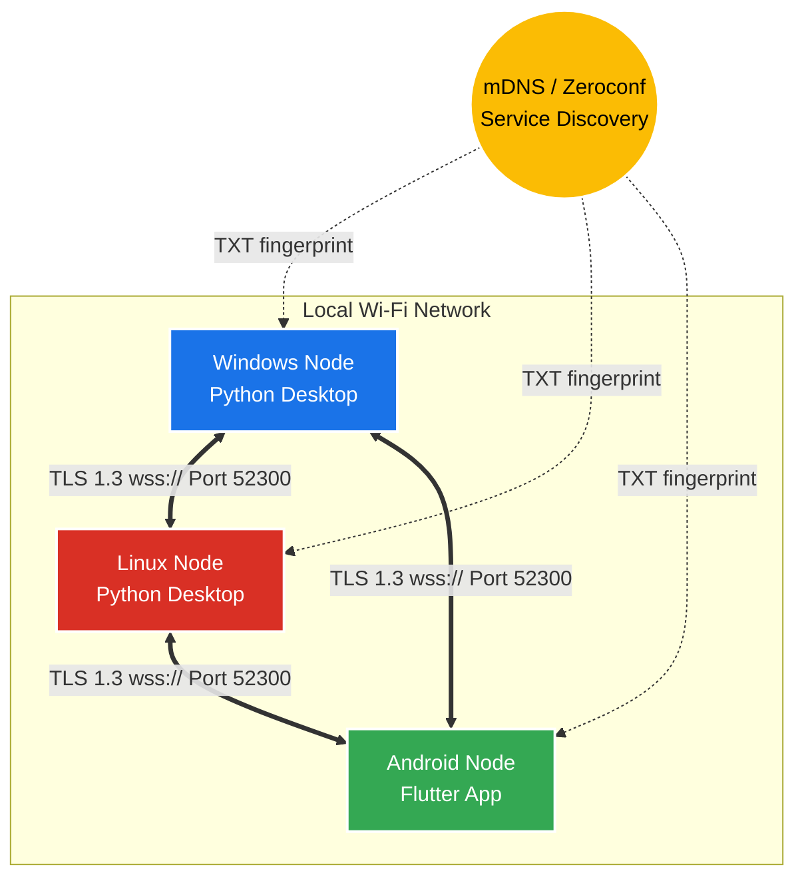

# ClipSync: Security & Architecture Report

ClipSync is a decentralized, cross-platform clipboard synchronization system designed to operate completely offline over Local Area Networks (LAN) and Wi-Fi. By bypassing cloud servers and external dependencies, ClipSync guarantees maximum privacy. This document outlines the cryptographic layers, network topology, and system architecture that powers ClipSync securely.

## 1. Network Topology: Decentralized P2P Mesh
Unlike traditional client-server models, ClipSync utilizes a **Full Mesh Topology**. Every single device (Node) in the network acts as both a Secure WebSocket Client and a Secure WebSocket Server simultaneously. 

### Architecture Diagram

* **Zero Configuration Discovery:** Devices broadcast their presence via **mDNS (Multicast DNS)** under the service type `_clipsync._tcp`. The broadcast includes a SHA-256 fingerprint of the user's `SECRET_KEY`. Devices silently ignore discovery packets from unmatched fingerprints.
* **Static Binding:** Nodes bind to a predefined port (default `52300`) to allow strict OS firewall rules.
* **Fault Tolerance:** If any device drops off the network, the others continue communicating seamlessly.

---

## 2. The Application Security Layer (E2EE)
Because mDNS broadcasts on the local LAN, any user sharing the Wi-Fi network could theoretically attempt connection. To combat this, ClipSync implements dual-layer security: **End-to-End Encryption (E2EE)** at the application layer, and **TLS 1.3** at the transport layer.

### 2.1 Cryptographic Protocol
* **Algorithm:** AES (Advanced Encryption Standard)
* **Key Size:** 256-bit
* **Mode of Operation:** GCM (Galois/Counter Mode)
* **Key Exchange:** Pre-Shared Key (PSK) via local `.env` files.
* **Transport Encryption:** WebSockets over TLS (`wss://`) using bundled self-signed X.509 RSA Certificates.

> [!CAUTION]
> **Why AES-GCM?** 
> AES-GCM provides **Authenticated Encryption with Associated Data (AEAD)**. It not only encrypts the payload but generates an authentication tag. If a hacker intercepts the packet and attempts to alter the clipboard text (tampering/bit-flipping), the decryption will fail because the GCM tag will no longer match the ciphertext.

### 2.2 The Encryption Flow
Whenever a device copies text, the payload undergoes the following transformation before touching the network:

1. **Content Filtering:** The raw text is parsed through a Regex engine to detect extremely sensitive data (16-digit credit cards, RSA Private Keys). If detected, the sync is blocked locally.
2. **Payload Generation:** The raw text is wrapped in a JSON object: `{"type": "clipboard", "text": "Hello World"}`
3. **Nonce Generation:** A Cryptographically Secure Pseudo-Random Number Generator (CSPRNG) generates a unique, 12-byte initialization vector (Nonce) for the packet.
4. **Encryption & Authentication:** The payload is encrypted using the 256-bit `SECRET_KEY` and the Nonce.
5. **Encoding:** The Nonce and the resulting Ciphertext are Base64 encoded.
6. **Transmission:** The fully encrypted JSON is blasted across the `wss://` tunnels.

---

## 3. Advanced Protection Mechanisms (v2.0)
To ensure the mesh is completely hardened against Rogue Nodes and Network Sniffing, the following advanced mechanisms are built into the protocol:

1. **Strict HMAC Authentication & Replay Protection:** The `hello` handshake natively enforces cryptographic integrity. It carries a real-time UTC timestamp and a UUID Nonce. The server enforces a strict 30-second synchronization window and maintains a local cache of previously seen Nonces. Any duplicate payloads or expired tokens are immediately rejected, entirely thwarting Replay Attacks.
2. **Deep Fingerprint Handshake Validation:** The mDNS `TXT` record broadcasts a truncated SHA-256 hash of the `SECRET_KEY` for network discovery. Crucially, the same cryptographic fingerprint is injected directly into the AES-GCM encrypted `hello` payload. The peer validates this fingerprint natively on the active WebSocket connection before accepting any clipboard traffic.
3. **Strict TLS 1.3 Compliance:** Raw WebSocket connections are wrapped in TLS 1.3 (`wss://`) using generated certificates with standard 1-year validities. The client dynamically inserts the local machine's IP address into the Subject Alternative Name (SAN) list, ensuring that even strict TLS clients seamlessly accept the secure tunnels.

## 4. Platform Implementations

### Windows & Linux (Python 3)
* **Background Daemon:** Runs silently utilizing `asyncio` for non-blocking I/O.
* **Clipboard Interaction:** Utilizes `pyperclip` to interact with native OS clipboards.

### Android (Flutter/Dart)
* **Share Intent UI:** Leverages the native Android Share Menu to push the text to desktops.
* **Persistent Notifications:** Implements a low-priority, ongoing background notification to trigger manual pulls.
