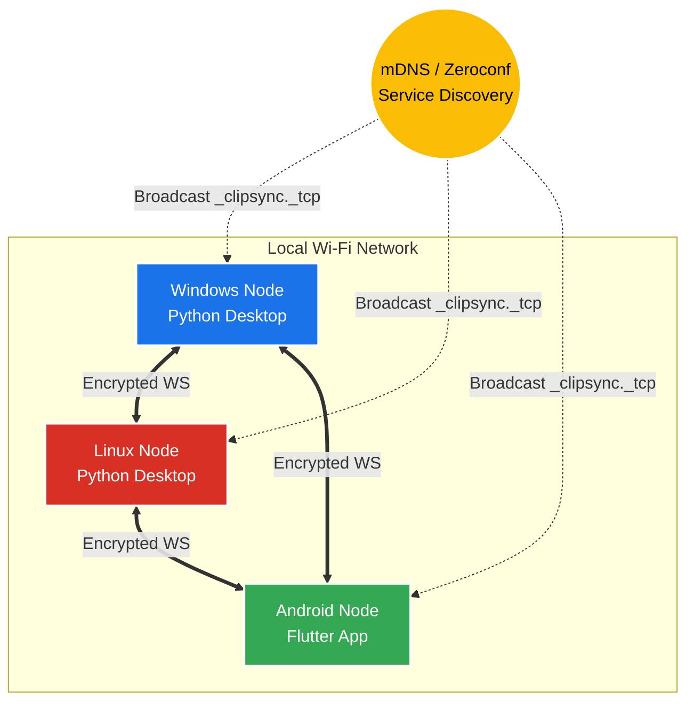

# ClipSync: Security & Architecture Report

ClipSync is a decentralized, cross-platform clipboard synchronization system designed to operate completely offline over Local Area Networks (LAN) and Wi-Fi. By bypassing cloud servers and external dependencies, ClipSync guarantees maximum privacy. This document outlines the cryptographic layers, network topology, and system architecture that powers ClipSync securely.

## 1. Network Topology: Decentralized P2P Mesh
Unlike traditional client-server models, ClipSync utilizes a **Full Mesh Topology**. Every single device (Node) in the network acts as both a WebSocket Client and a WebSocket Server simultaneously. 

### Architecture Diagram


* **Zero Configuration:** Devices broadcast their presence via **mDNS (Multicast DNS)** under the service type `_clipsync._tcp`. 
* **Dynamic Binding:** When a node discovers a peer, it extracts the local IP address (e.g., `192.168.1.5`) and dynamically binds an ephemeral WebSocket port to establish a direct tunnel.
* **Fault Tolerance:** If any device drops off the network, the others continue communicating seamlessly.

---

## 2. The Security Layer (E2EE)
Because mDNS and raw WebSockets send data in plaintext, any user sharing the Wi-Fi network (or a bad actor packet sniffing) could easily intercept clipboard data. To combat this, ClipSync implements **End-to-End Encryption (E2EE)** at the application layer.

### 2.1 Cryptographic Protocol
* **Algorithm:** AES (Advanced Encryption Standard)
* **Key Size:** 256-bit
* **Mode of Operation:** GCM (Galois/Counter Mode)
* **Key Exchange:** Pre-Shared Key (PSK) via local `.env` files.

> [!CAUTION]
> **Why AES-GCM?** 
> AES-GCM provides **Authenticated Encryption with Associated Data (AEAD)**. It not only encrypts the payload but generates an authentication tag. If a hacker intercepts the packet and attempts to alter the clipboard text (tampering/bit-flipping), the decryption will fail because the GCM tag will no longer match the ciphertext.

### 2.2 The Encryption Flow
Whenever a device copies text, the payload undergoes the following transformation before touching the network:

1. **Payload Generation:** The raw text is wrapped in a JSON object: `{"type": "clipboard", "text": "Hello World"}`
2. **Nonce Generation:** A Cryptographically Secure Pseudo-Random Number Generator (CSPRNG) generates a unique, 12-byte initialization vector (Nonce) for the packet.
3. **Encryption & Authentication:** The payload is encrypted using the 256-bit `SECRET_KEY` and the Nonce.
4. **Encoding:** The Nonce and the resulting Ciphertext are Base64 encoded.
5. **Transmission:** The fully encrypted JSON is blasted across the WebSocket tunnels.

```json
// What the network actually sees:
{
  "iv": "v4XbY/h8T3K1mNqL",
  "data": "9aXbY...[encrypted blob]...7f8g="
}
```


---

## 3. Platform Implementations

### Windows & Linux (Python 3)
* **Background Daemon:** Runs silently utilizing `asyncio` for non-blocking I/O.
* **Clipboard Interaction:** Utilizes `pyperclip` to interact with native OS clipboards (Windows API, X11, Wayland).
* **Monitoring:** Spins up an asynchronous background thread that continuously polls the clipboard (every `0.5s`) and triggers network broadcasts instantly upon detecting mutations.

### Android (Flutter/Dart)
* **Mobile Restrictions:** Modern Android versions (Android 10+) severely restrict apps from reading the clipboard while in the background for privacy reasons. 
* **Workarounds:**
  1. **Share Intent UI:** Leverages the native Android Share Menu. Users can highlight text in any app, tap "Share", and select ClipSync to immediately push the text to desktops.
  2. **Persistent Notifications:** Implements a low-priority, ongoing background notification. Tapping "Sync" triggers a foreground clipboard read request, grabbing Android's current clipboard and pushing it to the mesh network.

## 4. Summary
ClipSync achieves absolute security by marrying the convenience of decentralized mDNS service discovery with the cryptographic ironclad guarantees of AES-256-GCM. It operates strictly on the Local Area Network, guaranteeing zero latency, zero cloud dependency, and total peace of mind for the end user.
