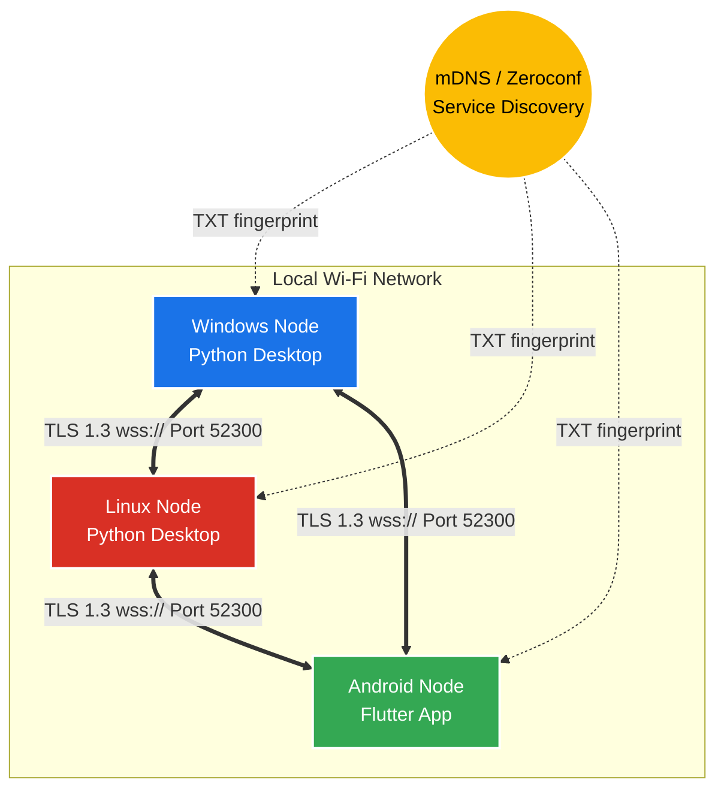

# ClipSync: Security & Architecture Report

ClipSync is a decentralized, cross-platform clipboard synchronization system designed to operate completely offline over Local Area Networks (LAN) and Wi-Fi. By bypassing cloud servers and external dependencies, ClipSync guarantees maximum privacy. This document outlines the cryptographic layers, network topology, and system architecture that powers ClipSync securely.

## 1. Network Topology: Decentralized P2P Mesh
Unlike traditional client-server models, ClipSync utilizes a **Full Mesh Topology**. Every single device (Node) in the network acts as both a Secure WebSocket Client and a Secure WebSocket Server simultaneously. 

### Architecture Diagram

* **Zero Configuration Discovery:** Devices broadcast their presence via **mDNS (Multicast DNS)** under the service type `_clipsync._tcp`. The broadcast includes a SHA-256 fingerprint of the user's `SECRET_KEY`. Devices silently ignore discovery packets from unmatched fingerprints.
* **Static Binding:** Nodes bind to a predefined port (default `52300`) to allow strict OS firewall rules.
* **Fault Tolerance:** If any device drops off the network, the others continue communicating seamlessly.

---

## 2. The Application Security Layer (E2EE)
Because mDNS broadcasts on the local LAN, any user sharing the Wi-Fi network could theoretically attempt connection. To combat this, ClipSync implements dual-layer security: **End-to-End Encryption (E2EE)** at the application layer, and **TLS 1.3** at the transport layer.

### 2.1 Cryptographic Protocol
* **Algorithm:** AES (Advanced Encryption Standard)
* **Key Size:** 256-bit
* **Mode of Operation:** GCM (Galois/Counter Mode)
* **Key Exchange:** Pre-Shared Key (PSK) stored via local `.env` files on Desktop nodes, and Secure Local Storage (`SharedPreferences`) on Mobile nodes.
* **Transport Encryption:** WebSockets over TLS (`wss://`) using bundled self-signed X.509 RSA Certificates.

> [!CAUTION]
> **Why AES-GCM?** 
> AES-GCM provides **Authenticated Encryption with Associated Data (AEAD)**. It not only encrypts the payload but generates an authentication tag. If a hacker intercepts the packet and attempts to alter the clipboard text (tampering/bit-flipping), the decryption will fail because the GCM tag will no longer match the ciphertext.

### 2.2 The Encryption Flow
Whenever a device copies text, the payload undergoes the following transformation before touching the network:

1. **Content Filtering:** The raw text is parsed through a Regex engine to detect extremely sensitive data (16-digit credit cards, RSA Private Keys). If detected, the sync is blocked locally.
2. **Payload Generation:** The raw text is wrapped in a JSON object: `{"type": "clipboard", "text": "Hello World"}`
3. **Nonce Generation:** A Cryptographically Secure Pseudo-Random Number Generator (CSPRNG) generates a unique, 12-byte initialization vector (Nonce) for the packet.
4. **Encryption & Authentication:** The payload is encrypted using the 256-bit `SECRET_KEY` and the Nonce.
5. **Encoding:** The Nonce and the resulting Ciphertext are Base64 encoded.
6. **Transmission:** The fully encrypted JSON is blasted across the `wss://` tunnels.

---

## 3. Advanced Protection Mechanisms (v3.0)
To ensure the mesh is completely hardened against Rogue Nodes, Network Sniffing, and Replay Attacks, the following advanced security mechanisms are enforced in the protocol:

1. **Authentication-before-Broadcast Enforcement (CS-001, CS-003, CS-006):** 
   A strict connection isolation protocol is implemented. When a peer connects via WebSocket, they are initially held in a sandboxed state. They are **not** added to the active broadcast client list and will not receive any clipboard data broadcasts until they successfully complete the cryptographic handshake. If the authentication payload is invalid, expired, or missing, the server responds with a `{"status": "rejected", "reason": "unauthorized"}` message and immediately closes the socket.
   
2. **Granular TTL-based Nonce Cache (CS-008):** 
   To prevent replay attacks, incoming handshakes must contain a unique nonce. Previously, nonces were cached in a set and periodically cleared in bulk (creating a race window where recently used nonces could be replayed). In v3.0, nonces are stored in a map along with their generation timestamp. The system performs granular, continuous eviction of expired nonces (older than 60 seconds), ensuring no nonce can be reused within the 30-second replay window without risking bulk cache clearance.

3. **Dynamic TLS 1.3 SAN Auto-Regeneration (CS-009, CS-007):** 
   To maintain strict TLS 1.3 validation without requiring static IP addresses:
   * **Node Autonomy:** Each device generates its own unique self-signed X.509 certificate. Certificates are not shared between devices, preventing impersonation.
   * **Auto-Regeneration:** At startup, Windows and Linux nodes automatically check if the IP address inside the Subject Alternative Name (SAN) of the existing `tls_cert.pem` matches the current active LAN IP of the node. If there is a mismatch, the node automatically regenerates a new 1-year validity TLS certificate with the correct IP SAN.
   * **Strict Validity:** Certificates are constrained to a secure 1-year expiration window (365 days) instead of insecure 100-year configurations.

## 4. Platform Implementations

### Windows & Linux (Python 3)
* **Background Daemon:** Runs silently utilizing `asyncio` for non-blocking I/O.
* **Clipboard Interaction:** Utilizes `pyperclip` to interact with native OS clipboards.

### Android (Flutter/Dart)
* **Share Intent UI:** Leverages the native Android Share Menu to push the text to desktops.
* **Persistent Notifications:** Implements a low-priority, ongoing background notification to trigger manual pulls.
